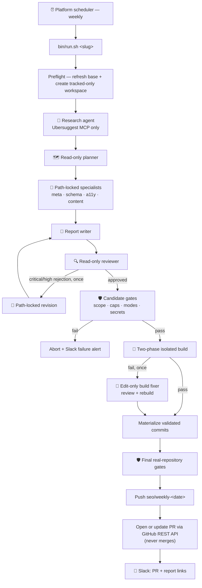

# 🚀 SEO Autopilot

**Wake up to a reviewed SEO pull request every week — prepared by a team of
least-privilege AI agents, gated by hard safety rules, and never merged without
you.**

SEO Autopilot pulls real findings from [Ubersuggest](https://neilpatel.com/ubersuggest/) (via its MCP server), lets a headless Claude agent team turn them into **scoped code edits** (titles, meta, JSON-LD, alt text, on-page copy), then opens a **pull request** and pings you on **Slack**. Run it manually or schedule it with `launchd`, cron/systemd, or Windows Task Scheduler through WSL2. You just review and merge.


> Built for **Next.js** repos (the agent knows App Router `generateMetadata`, JSON-LD, `sitemap.js`/`robots.js`, `llms.txt`), but the scope/caps/PR machinery is framework-agnostic.

---

## Quick start

**You need:** an authenticated [Claude Code](https://claude.com/claude-code) CLI
(a Claude subscription **or** an Anthropic API key — [details](#claude-plan-or-api-key)),
a paid Ubersuggest account, Docker running, plus `jq` and `gitleaks`.

```bash
# 1 — one-time machine setup
brew install jq gitleaks && brew install --cask docker   # Linux/WSL2: see One-time setup
claude mcp add --transport http --scope user ubersuggest https://ubersuggest-mcp.neilpatelapi.com/mcp
claude   # then run /mcp and authorize ubersuggest, once, interactively

# 2 — get the orchestrator
git clone https://github.com/akhemraj/seo-autopilot.git
cd seo-autopilot

# 3 — onboard a site (prompts for domain, repo path, schedule, scope, caps)
bin/add-site.sh mysite            # add --no-schedule on Linux/WSL2

# 4 — add credentials to the generated, gitignored secrets file
#     sites/mysite.secrets  →  SLACK_WEBHOOK_URL="…"  and  GH_TOKEN="github_pat_…"

# 5 — rehearse the entire workflow: no push, no PR, no Slack
bin/run.sh mysite --dry-run

# 6 — go live (macOS already scheduled it weekly during step 3)
bin/run.sh mysite
```

Then review the PR it opens. That's the whole loop.

**Before the first live run**, skim `sites/mysite.conf` — it defaults to
`EDITABLE_GLOBS="app/** components/** public/**"` and `BUILD_CMD="yarn build"`,
which suit an App Router repo on Yarn. Adjust both if yours differs, and point
`REPO_PATH` at a **dedicated clone**, not your day-to-day working copy.

Everything below is detail: [Requirements](#requirements) ·
[One-time setup](#one-time-setup) · [Site profile fields](#site-profile-fields-sitesslugconf) ·
[Safety](#safety) · [How the agent team works](docs/how-the-agents-work.md).

---

## Why

Technical SEO is a stream of small, tedious, easy-to-defer edits — a duplicate meta description here, a missing FAQ schema there, a thin page that needs 200 words. They rarely reach the top of the backlog. SEO Autopilot does the boring 80% **safely and continuously**, and escalates the judgment calls (cannibalization, redirects, slug renames) to you instead of guessing.

Crucially, it is **safe to run unattended**:

- **PR-only** — it never merges. Every change is a diff you approve.
- **Scope-locked** — a hard `scope_guard` fails the run closed if the agent touches anything outside an allowlist, anything on a denylist, a binary file, or blows past per-run caps.
- **Secret-tight** — your GitHub token and Slack webhook stay in the
  gitignored, mode-600 site secrets file. They never enter an agent, build
  container, command argument, candidate patch, or log.

## Features

- 🔌 **Pluggable & multi-site** — one config file per site; onboard another in one command.
- 🤖 **Agent team** — MCP-only research → read-only planning → four
  category specialists → report writer → read-only reviewer. A rejected
  critical/high finding gets one path-locked revision pass and an independent
  re-review.
- 🛡️ **Hard safety gate** — allowlist + denylist + binary rejection + caps, enforced *before* it pushes anything.
- 🧱 **Build gate** — runs your build in an isolated container. A failed build
  gets one edit-only repair pass, review, and rebuild; if it still fails, the PR
  opens as a **draft** labeled `needs-fix`.
- 📄 **Readable output** — a phased console log, a per-commit Markdown report, and a Slack message with the PR + report links.
- 🔁 **Resilient agents** — transient Claude API `429`/`5xx`/`529` responses
  retry up to three times before the run fails closed.
- 🧰 **Fail-closed isolation** — agents see only a tracked-source archive;
  generated code builds in Docker/Colima with no network or publishing secrets.
  **No `gh` CLI.**

## How it works



> **Why a team instead of one agent?** [How the agent team works](docs/how-the-agents-work.md)
> walks through the capability separation role by role — who may reach the network, who may
> read, who may write, and why the safety gates are plain code rather than another agent.

## Sample run

```text
  ┌────────────────────────────────────────────────────────┐
  │  SEO Autopilot · mysite · 2026-07-28                    │
  └────────────────────────────────────────────────────────┘
     •  mode:   LIVE (opens PR + Slack)
     •  caps:   <= 30 files · <= 10 new pages · <= 10000 lines
  ▶  [1/8] Preflight — refresh 'main'
     ✓  tracked-only workspace created from main
  ▶  [2/8] Agent team — research, plan, implement, report, review
     •  research: 18 finding(s) · tools: mcp__ubersuggest__…
     •  plan: 7 task(s) · meta 2 · schema 2 · a11y 1 · content 2
     •  agents working... 80s · 2 accepted category commit(s) · 1 pending file(s)
     ✓  agent team complete in 203s
  ▶  [3/8] Candidate safety — scope, caps, modes, secrets
     ✓  candidate passed deterministic safety gates
  ▶  [4/8] Isolated build gate
     ✓  isolated build passed
  ▶  [5/8] Final isolated safety check
     ✓  final candidate approved and passed deterministic gates
  ▶  [6/8] Materialize validated commits
     ✓  validated commits copied to seo/weekly-2026-07-28
  ▶  [7/8] Final real-repository safety check
     ✓  real branch matches validated scope and contains no detected secrets
  ▶  [8/8] Publish — push branch, open PR, notify Slack
     ✓  PR ready: https://github.com/you/site/pull/171
     ✓  Slack notified
```

**Slack message:**

> ✅ **SEO Autopilot — mysite**
> PR: `https://github.com/you/site/pull/171`
> `seo(meta): localize /blog metadata + de-duplicate titles`
> `seo(schema): add FAQ + BreadcrumbList JSON-LD`
> 📄 Report: `…/blob/seo/weekly-2026-07-28/tasks/seo/reports/2026-07-28.md`

Each run also writes a pretty **per-commit Markdown log** (`logs/<slug>/<date>.md`) with a collapsible diff per commit.

---

## Requirements

Everything runs on the machine that owns the schedule — there is no hosted
service and no server component.

| Requirement | Why |
| --- | --- |
| **Claude Code CLI, installed *and* authenticated** | Every agent is a headless `claude -p` run. |
| **A paid Ubersuggest account with MCP access** | The research agent's only data source. |
| **Docker (Desktop, Engine, or Colima) running** | The build gate refuses to run agent-written code on the host. |
| **`git`, `jq`, `gitleaks`, `curl`, Bash** | Safety gates, secret scanning, and PR creation. No Bash 4 features are used, so macOS's stock 3.2 is fine. |
| **A fine-grained GitHub PAT + a Slack incoming webhook** | Pushing the branch, opening the PR, and alerting you. |

### Claude plan or API key?

**Either works, and you do not configure it here.** The orchestrator invokes
whatever `claude` binary is on `PATH` (override with the `CLAUDE` environment
variable) and never reads, stores, or forwards Anthropic credentials. It simply
inherits the authentication your Claude Code install already has:

- a **Claude subscription** (Pro or Max) — runs consume your plan's usage limits, or
- an **Anthropic API key** — runs are billed as metered tokens.

Verify the machine is authenticated before onboarding a site:

```bash
claude -p "reply with: ok"
```

**Budget expectation.** A clean run is roughly **nine** headless agent
invocations — research, planner, four category specialists, report writer, and
two review passes — reading and editing real repository files. The optional
paths add more: a rejected review costs a revision, a report refresh, and a
re-review; a failed build costs a fixer plus another review. Weekly runs on a
Pro plan can therefore crowd out your interactive usage; **Max or API billing
is the comfortable choice** for unattended scheduling.

**Version.** Agents are launched with `--safe-mode`, `--json-schema`,
`--setting-sources`, `--no-session-persistence`, and `--strict-mcp-config`. If a
run fails with an unrecognized-flag error, update Claude Code (`claude --version`).

## One-time setup

1. **Ubersuggest MCP authorization** — a claude.ai *connector* is not enough
   for a headless `claude -p` run. Register and authorize the server once:
   ```bash
   claude mcp add --transport http --scope user ubersuggest https://ubersuggest-mcp.neilpatelapi.com/mcp
   ```
   Authorize once interactively (`claude` → `/mcp` → ubersuggest), then verify a headless run sees it:
   ```bash
   claude -p "call ubersuggest auth_status and report the output" --allowedTools "mcp__ubersuggest__*"
   ```
   It should print your account/tier. During an autopilot run, the orchestrator
   supplies its own strict MCP configuration containing only this Ubersuggest
   endpoint; tracked or user Claude settings cannot add another MCP server.
2. **Runtime safety dependencies**:
   ```bash
   brew install jq gitleaks
   brew install --cask docker   # macOS Docker Desktop
   # or on macOS: brew install colima docker && colima start
   ```
   On Linux, install Docker Engine from your distribution or Docker's official
   packages. On Windows, use Docker Desktop with WSL2 integration. Colima is
   macOS-only and is not required on Linux or WSL2.

   Docker must be running. Builds fail closed instead of executing
   agent-written project code directly on the host.
3. **Slack incoming webhook** — create one for the channel you want alerts in.
4. **Fine-grained GitHub PAT** — scoped to the target repo only, permissions **Contents: R/W** + **Pull requests: R/W**, with an expiry.

## Add a site

```bash
# Example: onboard example.com as the site slug "mysite"
bin/add-site.sh mysite

# The setup prompts for the domain, repository path, schedule, scope, and caps.
# If the repository path does not exist, provide its Git URL and it will be cloned.

# Add credentials to the generated, gitignored secrets file:
#   sites/mysite.secrets
#   SLACK_WEBHOOK_URL="https://hooks.slack.com/services/…"
#   GH_TOKEN="github_pat_…"

# Validate the complete workflow without pushing, opening a PR, or posting to Slack:
bin/run.sh mysite --dry-run
```

On Linux or WSL2, skip the macOS `launchd` installation:

```bash
bin/add-site.sh mysite --no-schedule
bin/run.sh mysite --dry-run
```

> **Tip:** point `REPO_PATH` at a **dedicated clone** of your repo (not your day-to-day working copy) so weekly runs never collide with your uncommitted work. `add-site.sh` will clone one for you if the path doesn't exist yet.

`add-site.sh` handles both cases:

- **Existing clone:** reuses it without cloning again.
- **Fresh setup:** clones into `~/seo-autopilot-repos/<slug>` by default.
- **Occupied non-Git directory:** stops without overwriting anything.

By default it creates the site profile, a permission-restricted secrets file,
and a macOS launchd schedule. `--no-schedule` creates the same profile, secrets
file, clone, and logs directory without invoking `launchctl`. For unattended
setup, provide values through `AS_*` environment variables (`AS_DOMAIN`,
`AS_REPO_PATH`, `AS_REPO_URL`, `AS_UBERSUGGEST_TARGET`, …).

## Platform scheduling

The core runner is the same on macOS, Linux, and Windows through WSL2. There is
no automatic OS detection.

### macOS

The default onboarding command installs the launchd schedule:

```bash
bin/add-site.sh mysite
bin/uninstall-site.sh mysite  # removes only the launchd schedule
```

Use either Docker Desktop or Colima as the Docker runtime.

### Linux

Onboard without launchd, then add the runner to your preferred scheduler:

```bash
bin/add-site.sh mysite --no-schedule
crontab -e
```

Example cron entry for Mondays at noon; replace both absolute paths:

```cron
0 12 * * 1 /bin/bash -lc 'cd /absolute/path/seo-autopilot-public && bin/run.sh mysite'
```

Native Docker Engine must be running. Colima is not used on Linux.

### Windows with WSL2

Install and authenticate Claude Code, Git, jq, Gitleaks, and the Docker CLI
inside the WSL distribution. Enable that distribution under Docker Desktop's
WSL integration, and keep the repositories in the WSL filesystem rather than
under `/mnt/c`.

```bash
bin/add-site.sh mysite --no-schedule
bin/run.sh mysite --dry-run
```

For automatic runs, Windows Task Scheduler can start the WSL command even when
the distribution is not already running. In PowerShell, replace the
distribution name, Linux username, and repository path:

```powershell
schtasks.exe /Create /F /SC WEEKLY /D MON /ST 12:00 `
  /TN "SEO Autopilot - mysite" `
  /TR "wsl.exe -d Ubuntu -- bash -lc 'cd /home/USER/seo-autopilot-public && bin/run.sh mysite'"
```

Remove that schedule with:

```powershell
schtasks.exe /Delete /F /TN "SEO Autopilot - mysite"
```

Native Windows shells are not supported; run the Bash workflow inside WSL2.

### Site profile fields (`sites/<slug>.conf`)

| Field | Default | Description |
|---|---:|---|
| `DOMAIN` | *required* | Public website domain, used in logs, reports, and PR titles. |
| `REPO_PATH` | *required* | Absolute path to the dedicated local Git clone the automation edits. |
| `UBERSUGGEST_TARGET` | *required* | Domain / project identifier queried through the Ubersuggest MCP. |
| `BASE_BRANCH` | `main` | Branch refreshed before each run and used as the PR base. |
| `SCHEDULE_HOUR` | `12` | Local start hour, 24-hour (`0–23`). |
| `SCHEDULE_WEEKDAY` | `1` | launchd weekday: `0`=Sun, `1`=Mon, … `6`=Sat. |
| `EDITABLE_GLOBS` | `app/** components/** public/**` | Space-separated globs the agent may change (allowlist). |
| `EXCLUDE_GLOBS` | includes root/nested `.env*`, `*.secrets`, build output, locks, and package config | Forbidden paths (denylist). **Exclusions always win over the allowlist.** |
| `MAX_FILES` | `12` | Max changed files per run. |
| `MAX_NEW_PAGES` | `2` | Max newly added pages/routes per run. |
| `MAX_DIFF_LINES` | `1500` | Max combined added+removed lines. |
| `BUILD_CMD` | `yarn build` | Build validation command; empty string disables the build gate. |
| `DEPENDENCY_CMD` | `auto` | Detects npm, Yarn, or pnpm and installs from the lockfile with lifecycle scripts disabled. Set a trusted custom command, or `none` to skip. |
| `BUILD_ISOLATION` | `docker` | Must remain `docker`; host execution of agent-written code is refused. |
| `BUILD_IMAGE` | `node:22-bookworm` | Base image used for dependency preparation and the networkless build. Override it when the project needs additional system packages. |
| `BUILD_MEMORY` / `BUILD_CPUS` | `2g` / `2` | Container resource limits. |
| `PR_LABELS` | `seo,automated` | Comma-separated PR labels. |
| `PR_REVIEWERS` | *empty* | Reserved reviewer list (stored, not yet auto-applied). |
| `NOTES` | *empty* | Site-specific instructions passed to the SEO edit agent. |

## How it runs

- Your selected platform scheduler triggers `bin/run.sh <slug>`. macOS launchd
  uses the profile's default Monday-noon schedule; cron/systemd/Task Scheduler
  use the schedule you configure externally.
- Research can call only the explicitly configured Ubersuggest MCP tools. The
  planner and reviewer are read-only. Each implementation specialist receives
  an exact path allowlist derived from the plan; changing any companion path
  that the planner did not name fails the run.
- A reviewer rejection with actionable critical/high findings gets exactly one
  revision pass. The revision may touch only flagged paths already present in
  the candidate diff, after which the report is regenerated and a fresh review
  must approve it.
- A failed isolated build gets exactly one edit-only fixer pass using the build
  output, followed by review and one rebuild. In a live run, a candidate that
  still fails the build is published only as a draft PR labeled `needs-fix`.
- Logs: `logs/<slug>/<date>.log` (raw),
  `logs/<slug>/<date>.md` (pretty, per-commit), and
  `logs/<slug>/<date>.agents.json` (mode-600 structured research, planning,
  category, report, revision/fix when used, and review audit). The first
  rejected review is retained as `review_initial`; secret-like agent output is
  omitted from the audit. On macOS,
  `bin/uninstall-site.sh <slug>` removes the launchd schedule while keeping the
  profile and secrets.
- A clean success, no-change result, or dry run restores the dedicated clone to
  `BASE_BRANCH`. A failed run retains its isolated temporary workspace and logs
  its path for debugging; this workspace contains tracked source and agent
  output, but not the source repo's `.git` directory or publishing credentials.
- Live runs use the dated `seo/weekly-<date>` branch. If an open PR already
  exists for that branch, its body and labels are updated instead of creating a
  duplicate PR.

## Safety

- **PR-only** — never auto-merges. Build failure → the PR opens as a **draft** labeled `needs-fix`.
- **Least-privilege roles** — research has Ubersuggest MCP access but no
  filesystem tools; planning and review are read-only; edit roles have no Bash,
  Git, web, skills, or MCP tools and are constrained by trusted exact paths.
- **Scope lock** — `scope_guard` fails closed *before* the build: every changed file must match `EDITABLE_GLOBS`, must match none of `EXCLUDE_GLOBS` (including nested paths), binary changes are rejected, per-run caps are enforced, and the worktree must have no stray uncommitted edits.
- **Secret hygiene** — `GH_TOKEN` / `SLACK_WEBHOOK_URL` are stored only in
  the gitignored, mode-600 `sites/<slug>.secrets`. Agents and builds receive
  neither value. Gitleaks scans newly introduced candidate content, while
  exact-value checks scan the complete tracked tree for the loaded publishing
  credentials; either match blocks publication.
  The Git credential helper returns the PAT only for the profile's exact
  `https://github.com/owner/repo`.
- **Configuration isolation** — agents ignore user, project, and local Claude
  settings sources. Only the orchestrator's generated settings and explicit
  Ubersuggest MCP configuration are loaded, so tracked `.claude/settings.json`
  files cannot widen permissions or require trusting ephemeral workspaces.
- **Two-phase build isolation** — dependency installation may access the
  network but uses immutable manifests and disables lifecycle scripts. The
  actual project build then runs with no network, no host home, and no
  publishing credentials. Dependency definitions are a hard, non-configurable
  agent denylist.
- **Failure alerts** — logging and the error trap are installed before the profile even loads, so almost any failure still pings Slack.

> The token credential helper only applies to **HTTPS** remotes; for an SSH-form `origin`, `git push` uses your ambient SSH key (the run warns about this).

## Tests

```bash
./test/run.sh        # fully mocked; no network or real credentials
```

## Layout

```
bin/run.sh             trusted multi-agent orchestrator and publish workflow
bin/add-site.sh        onboard a site; optionally skip launchd
bin/uninstall-site.sh  remove a macOS launchd schedule
lib/profile.sh         load/validate/default a site profile
lib/log.sh             phased console log + Markdown run log
lib/notify.sh          Slack webhook (URL via stdin)
lib/agents.sh          least-privilege role invocation and structured outputs
lib/workspace.sh       tracked-only workspace and trusted commit transfer
lib/security.sh        secret/mode gates and isolated container builds
lib/git_ops.sh         preflight, dated branch, scope_guard, caps
lib/remote.sh          strict GitHub remote parsing
lib/pr.sh              GitHub REST PR create/update (curl+jq, token off argv)
commands/agents/       separated research/plan/edit/report/review/revise/fix prompts
templates/             profile / secrets / launchd plist templates
sites/                 <slug>.conf + <slug>.secrets (both gitignored; you provide them)
```

## License

[MIT](LICENSE) — do whatever you like; no warranty.
