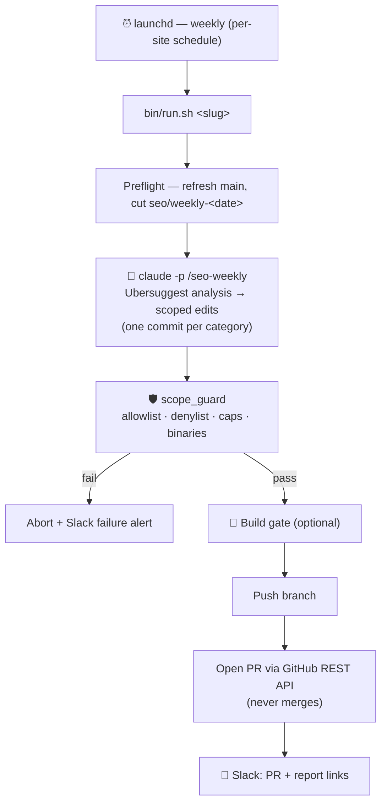

# 🚀 SEO Autopilot

**Wake up to a reviewed SEO pull request every week — opened by an AI agent, gated by hard safety rules, and never merged without you.**

SEO Autopilot pulls real findings from [Ubersuggest](https://neilpatel.com/ubersuggest/) (via its MCP server), lets a headless Claude agent turn them into **scoped code edits** (titles, meta, JSON-LD, alt text, on-page copy), then opens a **pull request** and pings you on **Slack**. It runs itself weekly via `launchd`. You just review and merge.


> Built for **Next.js** repos (the agent knows App Router `generateMetadata`, JSON-LD, `sitemap.js`/`robots.js`, `llms.txt`), but the scope/caps/PR machinery is framework-agnostic.

---

## Why

Technical SEO is a stream of small, tedious, easy-to-defer edits — a duplicate meta description here, a missing FAQ schema there, a thin page that needs 200 words. They rarely reach the top of the backlog. SEO Autopilot does the boring 80% **safely and continuously**, and escalates the judgment calls (cannibalization, redirects, slug renames) to you instead of guessing.

Crucially, it is **safe to run unattended**:

- **PR-only** — it never merges. Every change is a diff you approve.
- **Scope-locked** — a hard `scope_guard` fails the run closed if the agent touches anything outside an allowlist, anything on a denylist, a binary file, or blows past per-run caps.
- **Secret-tight** — your GitHub token and Slack webhook never appear in `argv`/`ps`, on disk, or in logs, and are **stripped from the edit agent's own environment** (it consumes untrusted third-party data, so it must never be able to commit a secret).

## Features

- 🔌 **Pluggable & multi-site** — one config file per site; onboard another in one command.
- 🤖 **Real data, real edits** — Ubersuggest Site Audit + keyword gaps → committed code changes, one commit per category (`seo(meta)`, `seo(schema)`, `seo(a11y)`, `seo(content)`).
- 🛡️ **Hard safety gate** — allowlist + denylist + binary rejection + caps, enforced *before* it pushes anything.
- 🧱 **Build gate** — runs your build; if it fails, the PR opens as a **draft** labeled `needs-fix`.
- 📄 **Readable output** — a phased console log, a per-commit Markdown report, and a Slack message with the PR + report links.
- 🔁 **Idempotent** — re-running the same week updates the existing PR instead of duplicating it.
- 🧰 **No heavy deps** — just `bash`, `git`, `curl`, `jq`, and Claude Code. **No `gh` CLI.**

## How it works



## Sample run

```text
  ┌────────────────────────────────────────────────────────┐
  │  SEO Autopilot · mysite · 2026-07-28                    │
  └────────────────────────────────────────────────────────┘
     •  mode:   LIVE (opens PR + Slack)
     •  caps:   <= 30 files · <= 10 new pages · <= 10000 lines
  ▶  [1/6] Preflight — refresh 'main', cut the work branch
     ✓  on seo/weekly-2026-07-28 (cut from main)
  ▶  [2/6] Analysis — Ubersuggest + scoped edits (agent runs silently)
     •  working... 40s elapsed · 4 commit(s) so far · 3 file(s) in progress
     ✓  analysis complete in 203s · 6 commit(s)
  ▶  [3/6] Pre-build safety — clean worktree · scope · caps · binaries
     ✓  scope OK — safe to execute the build
  ▶  [4/6] Build gate
     ✓  build passed
  ▶  [5/6] Publish — push branch, open PR, notify Slack
     ✓  PR ready: https://github.com/you/site/pull/171
     ✓  Slack notified
```

**Slack message:**

> ✅ **SEO Autopilot — mysite**
> PR: `https://github.com/you/site/pull/171`
> `seo(meta): localize /blog metadata + de-duplicate titles`
> `seo(schema): add FAQ + BreadcrumbList JSON-LD`
> 📄 Report: `…/blob/seo/weekly-2026-07-28/tasks/seo/reports/2026-07-28.md`

Each run also writes a pretty **per-commit Markdown log** (`logs/<slug>/<date>.md`) with a collapsible diff per commit.

---

## One-time setup

1. **Ubersuggest MCP — as a LOCAL user-scoped server** (a claude.ai *connector* is NOT loaded by headless `claude -p`, so the weekly run can't see it):
   ```bash
   claude mcp add --transport http --scope user ubersuggest https://ubersuggest-mcp.neilpatelapi.com/mcp
   ```
   Authorize once interactively (`claude` → `/mcp` → ubersuggest), then verify a headless run sees it:
   ```bash
   claude -p "call ubersuggest auth_status and report the output" --allowedTools "mcp__ubersuggest__*"
   ```
   It should print your account/tier. If you name the server something other than `ubersuggest`, set `UBER_TOOLS="mcp__<name>__*"` in the profile.
2. **`jq`** — `brew install jq` (used to build/parse GitHub API JSON). **No `gh` CLI needed** — PRs go through the REST API.
3. **Slack incoming webhook** — create one for the channel you want alerts in.
4. **Fine-grained GitHub PAT** — scoped to the target repo only, permissions **Contents: R/W** + **Pull requests: R/W**, with an expiry.

## Add a site

```bash
# Example: onboard example.com as the site slug "mysite"
bin/add-site.sh mysite

# The setup prompts for the domain, repository path, schedule, scope, and caps.
# If the repository path does not exist, provide its Git URL and it will be cloned.

# Add credentials to the generated, gitignored secrets file:
#   sites/mysite.secrets
#   SLACK_WEBHOOK_URL="https://hooks.slack.com/services/…"
#   GH_TOKEN="github_pat_…"

# Validate the complete workflow without pushing, opening a PR, or posting to Slack:
bin/run.sh mysite --dry-run
```

> **Tip:** point `REPO_PATH` at a **dedicated clone** of your repo (not your day-to-day working copy) so weekly runs never collide with your uncommitted work. `add-site.sh` will clone one for you if the path doesn't exist yet.

`add-site.sh` handles both cases:

- **Existing clone:** reuses it without cloning again.
- **Fresh setup:** clones into `~/seo-autopilot-repos/<slug>` by default.
- **Occupied non-Git directory:** stops without overwriting anything.

It then creates the site profile, a permission-restricted secrets file, and the macOS launchd schedule (with a `PATH` covering `claude`, Node.js, Yarn, `jq`, Git, and `curl` under launchd's minimal environment). For unattended setup, provide values through `AS_*` environment variables (`AS_DOMAIN`, `AS_REPO_PATH`, `AS_REPO_URL`, `AS_UBERSUGGEST_TARGET`, …).

### Site profile fields (`sites/<slug>.conf`)

| Field | Default | Description |
|---|---:|---|
| `DOMAIN` | *required* | Public website domain, used in logs, reports, and PR titles. |
| `REPO_PATH` | *required* | Absolute path to the dedicated local Git clone the automation edits. |
| `UBERSUGGEST_TARGET` | *required* | Domain / project identifier queried through the Ubersuggest MCP. |
| `BASE_BRANCH` | `main` | Branch refreshed before each run and used as the PR base. |
| `SCHEDULE_HOUR` | `12` | Local start hour, 24-hour (`0–23`). |
| `SCHEDULE_WEEKDAY` | `1` | launchd weekday: `0`=Sun, `1`=Mon, … `6`=Sat. |
| `EDITABLE_GLOBS` | `app/** components/** public/**` | Space-separated globs the agent may change (allowlist). |
| `EXCLUDE_GLOBS` | `node_modules/** .next/** *.lock *.env* next.config.* package.json` | Forbidden paths (denylist). **Exclusions always win over the allowlist.** |
| `MAX_FILES` | `12` | Max changed files per run. |
| `MAX_NEW_PAGES` | `2` | Max newly added pages/routes per run. |
| `MAX_DIFF_LINES` | `1500` | Max combined added+removed lines. |
| `BUILD_CMD` | `yarn build` | Build validation command; empty string disables the build gate. |
| `PR_LABELS` | `seo,automated` | Comma-separated PR labels. |
| `PR_REVIEWERS` | *empty* | Reserved reviewer list (stored, not yet auto-applied). |
| `NOTES` | *empty* | Site-specific instructions passed to the SEO edit agent. |

## How it runs

- launchd triggers `bin/run.sh <slug>` weekly (default Mon 12:00; per-site in the profile). If the Mac is asleep, launchd runs the missed job on next wake. It must be on and logged in at the scheduled time.
- Logs: `logs/<slug>/<date>.log` (raw) and `logs/<slug>/<date>.md` (pretty, per-commit). Remove a schedule: `bin/uninstall-site.sh <slug>` (keeps the profile/secrets).
- The run restores your clone to `BASE_BRANCH` when it finishes cleanly (a failed run leaves its branch checked out for debugging).
- Re-running the same week is idempotent: it reuses `seo/weekly-<date>` and updates the existing PR.

## Safety

- **PR-only** — never auto-merges. Build failure → the PR opens as a **draft** labeled `needs-fix`.
- **Scope lock** — `scope_guard` fails closed *before* the build: every changed file must match `EDITABLE_GLOBS`, must match none of `EXCLUDE_GLOBS` (including nested paths), binary changes are rejected, per-run caps are enforced, and the worktree must have no stray uncommitted edits.
- **Secret hygiene** — `GH_TOKEN` / `SLACK_WEBHOOK_URL` reach `curl` via `--config -` (stdin) and `git push` via an env-reading credential helper, so they never appear in `argv`/`ps`, on disk, or in logs — and are **stripped from the headless edit agent's environment** (`env -u …`).
- **Failure alerts** — logging and the error trap are installed before the profile even loads, so almost any failure still pings Slack.

> The token credential helper only applies to **HTTPS** remotes; for an SSH-form `origin`, `git push` uses your ambient SSH key (the run warns about this).

## Tests

```bash
./test/run.sh        # 87 assertions, fully mocked (curl/claude/launchctl); no network, no secrets
```

## Layout

```
bin/run.sh             orchestrator (deterministic git/PR/Slack; calls the agent for analysis+edits)
bin/add-site.sh        onboard a site (clone/profile/secrets/launchd)
bin/uninstall-site.sh  remove a site's schedule
lib/profile.sh         load/validate/default a site profile
lib/log.sh             phased console log + Markdown run log
lib/notify.sh          Slack webhook (URL via stdin)
lib/git_ops.sh         preflight, idempotent branch, scope_guard, caps
lib/pr.sh              GitHub REST PR create/update (curl+jq, token off argv)
commands/seo-weekly.md the SEO "brain" — the /seo-weekly Claude command
templates/             profile / secrets / launchd plist templates
sites/                 <slug>.conf + <slug>.secrets (both gitignored; you provide them)
```

## License

[MIT](LICENSE) — do whatever you like; no warranty.
