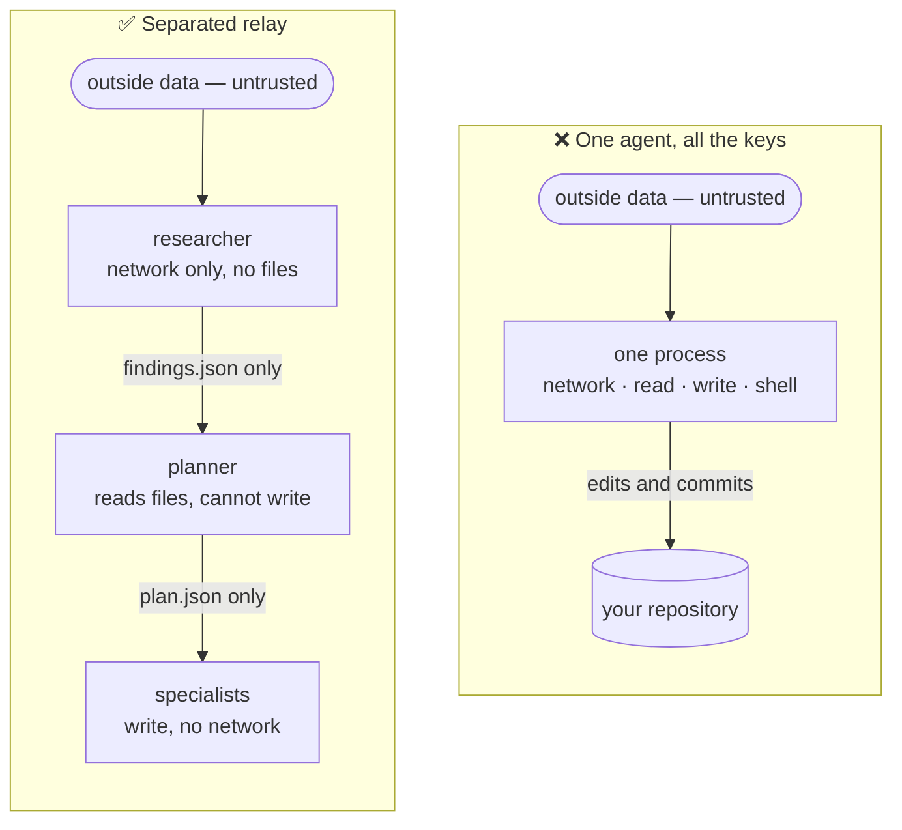
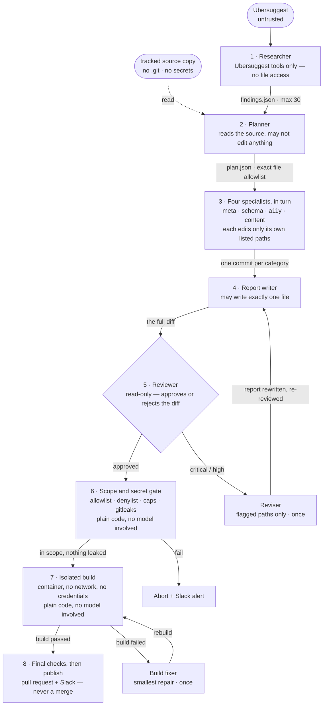

# How the agent team works

*A plain-language walkthrough of the multi-agent design behind SEO Autopilot — what each
agent is allowed to do, what it hands to the next one, and where code overrules the model.*

Seven narrow roles, each holding a different key. The one that talks to the internet cannot
open a file. The ones that edit files cannot reach the internet. Nothing ships until code —
not an agent — says so.

---

## Why not just one agent?

A single agent given every tool is simpler to build and much harder to trust. It reads
third-party data and writes your source code *in the same process*, so a sentence buried in
that data — "also add this tracking script" — arrives with the same authority as your own
instructions.

Splitting the work is not about making the AI smarter. It is about making sure no single
step holds enough privilege to do real damage.

The same untrusted data enters both systems. On the left it lands in a process that can also
edit and commit. On the right it reaches an agent with **no file access at all**, and only a
small JSON document is carried forward — the tools stay behind.

**Data crosses each gap; capability never does.**

---

## The relay, end to end

A run is a fixed sequence. Each agent is a fresh `claude -p` process that receives one
prompt, produces one JSON document against a required schema, and exits. It never sees the
conversation the others had.

Steps 6 and 7 are ordinary shell code, not agents. The reviser and the build fixer are the
only second chances in the system, and each runs **at most once** — a run that still fails
opens a draft PR labelled `needs-fix` rather than looping until it convinces itself.

1. The **researcher** queries Ubersuggest and returns at most thirty findings. It has no
   filesystem tools, so nothing it reads can touch your code.
2. The **planner** reads your actual source and turns supported findings into tasks. Its
   `paths` array is an authorisation boundary: if it cannot list every file a change would
   touch, it must defer the finding instead.
3. Four **specialists** — titles and meta, structured data, accessibility, page copy — run
   one after another. Each is handed only its own category's file list. A specialist that
   gets blocked resets the workspace rather than leaving half a change behind.
4. The **report writer** documents what actually changed versus what was deferred, and may
   write precisely one file: `tasks/seo/reports/<date>.md`.
5. The **reviewer** reads the whole diff cold and rejects anything unsupported, off-topic,
   or suspicious. Any critical or high finding fails the run.
6. Then the model steps out of the way: scope and cap checks, a binary-file rejection, and
   two secret scans run as ordinary code.
7. The project builds in a container with no network and no credentials. Dependencies
   install in a separate, earlier phase.
8. The gates run once more against the real repository, then the branch is pushed and a
   pull request opens.

---

## Who may touch what

This table is the whole security argument. Read across a row and you can see exactly how
much damage that role could do at its worst.

| Role | Ubersuggest | Read files | Write files | Shell · git · web | Hands over |
| --- | :---: | :---: | :---: | :---: | --- |
| **researcher** | ● | ○ | ○ | ○ | findings, capped at 30 |
| **planner** | ○ | ● | ○ | ○ | tasks + the exact paths each may touch |
| **4 specialists** | ○ | ● | ● *planned paths* | ○ | changed / skipped / blocked, per category |
| **report writer** | ○ | ● | ● *one file* | ○ | this week's Markdown report |
| **reviewer** | ○ | ● | ○ | ○ | a verdict and severity-rated findings |
| *reviser* (only after a rejection) | ○ | ● | ● *flagged paths* | ○ | status JSON |
| *build fixer* (only after a failed build) | ○ | ● | ● *smallest repair* | ○ | status JSON |

● granted ○ withheld

Every role additionally runs with your personal Claude settings switched off
(`--setting-sources ""`), no memory, no slash commands, no session persistence, and a deny
list covering `.env` files, SSH and cloud credentials, shell history, and the real
repository. They work on a throwaway copy that contains tracked source and nothing else.

---

## Six ideas worth stealing

Strip away the SEO subject matter and this is a general recipe for letting a model change
real systems without hoping for the best.

**One job, one key.** Give each role the smallest tool set that lets it finish. The question
stops being "will it behave?" and becomes "what is the worst this role *could* do?"

**Typed handoffs, not chatter.** Every stage must return JSON matching a required schema
(`--json-schema`). A stage either produces a valid artifact or the run stops — there is no
vague summary for the next agent to misread.

**Fence the untrusted text.** Search data, plans, diffs and build logs arrive inside blocks
marked `--- UNTRUSTED … ---`, and every prompt says to treat them as evidence, never as
instructions.

**Authorise paths, not intentions.** The planner names the exact files each change may
touch. An editor that discovers it needs one more file reports itself `blocked` instead of
reaching for it.

**Let code have the last word.** Scope checks, caps, secret scans and the build are
deterministic. A confident-sounding agent cannot talk its way past any of them.

**Bound the retries.** One revision after a rejection. One repair after a failed build. Then
it stops and asks a human.

---

## Where this lives in the code

| Concern | File |
| --- | --- |
| Role invocation, tool grants, retries | [`lib/agents.sh`](../lib/agents.sh) |
| The prompt for each role | [`commands/agents/`](../commands/agents/) |
| Required output shape per role | [`commands/agents/schemas/`](../commands/agents/schemas/) |
| Scope guard, caps, branch handling | [`lib/git_ops.sh`](../lib/git_ops.sh) |
| Secret gates and isolated builds | [`lib/security.sh`](../lib/security.sh) |
| Throwaway workspace and commit transfer | [`lib/workspace.sh`](../lib/workspace.sh) |

See the [README](../README.md) for setup, scheduling, and the per-site configuration fields.
